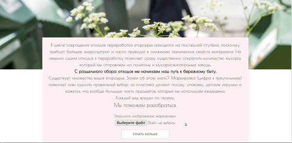

# Trashly

Trashly - это небольшое веб-приложения использующее Google Cloud Vision API для распознавания маркировки перерабатываемого пластика и API Yandex-map для отображения пунктов переработки.

